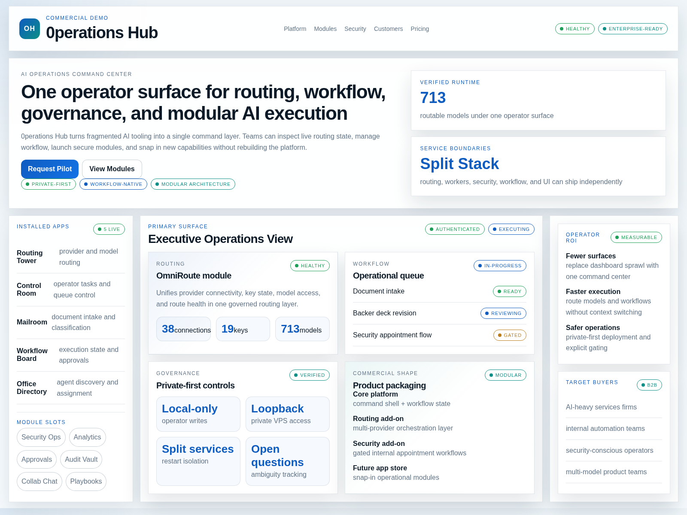
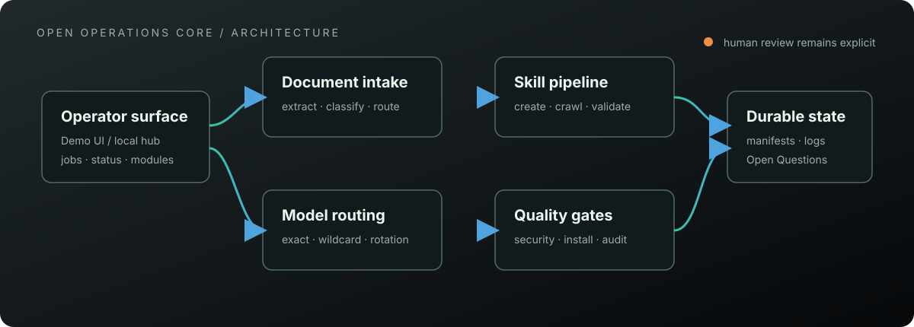

# Open Operations Core

### A local-first coordination layer for AI tools, documents, workflows, and agent skills.

Open Operations Core is a small, inspectable foundation for building an AI operations command center. It brings model routing, document intake, skill generation, quality gates, and operator visibility into one modular shape—without requiring a public SaaS account or hiding the important state behind a black box.

> **Status:** public release candidate. The code is sanitized, reviewable, and designed for local-first experimentation.

[](#security-and-deployment-boundary)
[](#quick-start)
[](#run-the-demo-surface)
[](LICENSE)

<p align="center">
  
</p>

## The short version

AI projects often accumulate provider consoles, prompt files, scripts, agent skills, workflow notes, and half-connected dashboards. Open Operations Core provides the coordination pattern between those pieces:

```text
       operator / local UI
                │
     ┌──────────┴──────────┐
     │                     │
 document intake      model routing
     │                     │
 skill / reference    exact + wildcard
 retrieval / project  + round-robin keys
     │                     │
     └──────────┬──────────┘
                │
   validated skills + durable manifests
          + explicit Open Questions
```

The core is intentionally boring in the best way: deterministic routing and state live in code; models help with model work, classification, and dialogue, but they do not silently decide where ambiguity goes or replace the execution boundary.

## Why this repository exists

This project began as a private operations hub for one operator managing a growing stack of AI tools. The public release extracts the reusable pieces:

| Problem | Included answer |
| --- | --- |
| Too many model/provider endpoints | OpenAI-compatible routing harness with exact model matches, wildcard fallback, and per-model round-robin selection |
| Documents have unclear destinations | Mailroom-style intake classifier for skills, references, retrieval, projects, video, security, and Open Questions |
| Skills are manually copied between agent tools | Super-Skill Generator pipeline with crawling, dependency scanning, validation, security scanning, and platform adapters |
| Operators cannot see what is happening | Small demo surface showing routing, workflow, governance, and future module slots |
| Public projects accidentally expose private assumptions | Explicit release boundary, placeholder environment, ignore rules, and repeatable secret scan |

## Architecture

<p align="center">
  
</p>

The repository has four composable layers:

1. **Operator surface** — a deliberately simple demo page for communicating the product shape and a future local hub UI.
2. **Intake and routing** — Python code that classifies documents and selects the correct model key without exposing key values.
3. **Skill supply chain** — Super-Skill Generator, synthesized from a five-phase creation pipeline and a documentation/dependency crawler.
4. **Durable artifacts** — manifests, generated skills, and explicit Open Questions that can be inspected, versioned, or moved into a larger application.

## What is included

### Model-routing harness

`orchestrator/run.py` is a minimal OpenAI-compatible client that:

- reads configuration from environment variables or a local `.env`;
- uses `ORCHESTRATOR_BASE_URL` as the shared endpoint;
- maps `LLM_KEY_N_MODELS` entries to key indexes;
- keeps exact model matches ahead of wildcard fallback;
- rotates through multiple exact matches per model in memory/runtime state;
- logs only the selected key index, never the key value;
- fails loudly when no model mapping exists.

Example configuration:

```dotenv
ORCHESTRATOR_BASE_URL=http://127.0.0.1:20128
ORCHESTRATOR_MODEL=example-model
LLM_KEY_1=replace-me
LLM_KEY_1_MODELS=example-model
```

Use a real key only through a local secret manager or ignored `.env`. The repository does not ship a provider key, cookie, account identifier, or personal endpoint.

### Document intake

`orchestrator/intake_document.py` accepts text-bearing files and extracts enough structure to produce a route decision. It supports plain text and common document formats, identifies secret-like content before downstream handling, and emits a manifest with:

- file type and extraction status;
- SHA-256 and size metadata;
- route and confidence;
- reasons for the decision;
- next recommended step;
- an Open Questions section when the document is ambiguous.

The classifier is intentionally a first-pass triage layer. It does not claim to understand every document, and it does not silently convert unclear material into an agent skill.

### Super-Skill Generator

`repo_synthesis/super-skill-creator/` contains the reusable skill-generation package:

- `ssg create` — generate a skill from a natural-language description;
- `ssg crawl` — crawl documentation into Markdown references;
- `ssg validate` — check structure and quality rules;
- `ssg security` — scan for dangerous patterns and credential exposure;
- `ssg install` — install to supported agent platforms;
- `ssg scan-deps` — scan dependencies and generate crawl rules.

The platform registry includes native or adapted targets for Codex, Claude Code, OpenCode, Goose, Cursor, Windsurf, Cline, Aider, Copilot, Trae, Kiro, and Amp.

### Commercial demo surface

`web/pages/demo-command-center.php` and `web/assets/demo-command-center.css` show the intended product direction:

- top-level product framing;
- proof cards for runtime capabilities;
- installed modules and future module slots;
- routing, workflow, governance, and product packaging cards;
- operator ROI and target-buyer framing;
- dark graphite styling with green, blue, and orange state accents.

Run it locally with:

```bash
cd web
php -S 127.0.0.1:8080
```

Then open `http://127.0.0.1:8080/pages/demo-command-center.php`.

## Quick start

### Run the routing harness

```bash
cp .env.example .env
python3 orchestrator/run.py "classify the next safe operation"
```

The command requires an OpenAI-compatible endpoint and a configured model mapping. For a no-network test, use a local mock server and dummy values.

### Run document intake without writing a manifest

```bash
python3 orchestrator/intake_document.py --json --no-manifest ./notes.md
```

Add `--store` only when you intentionally want the source copied into a local Mailroom directory.

### Install Super-Skill Generator

```bash
cd repo_synthesis/super-skill-creator
python3 -m venv .venv
source .venv/bin/activate
pip install -e .
ssg --help
```

## Security and deployment boundary

This is not an unauthenticated public command runner. Before exposing it to another user or network, add:

- authentication and authorization;
- explicit command and tool permissions;
- tenant/workspace isolation;
- a managed secret store and key rotation;
- audit retention and redaction rules;
- rate limiting and provider-policy checks;
- backup and restore procedures;
- network restrictions for powerful tools.

The public staging tree intentionally excludes the private dashboard, camera feeds, VPS addresses, SSH paths, migration archives, provider state, cookies, API keys, personal agent directory, local logs, and private project notes.

Run the release scan before every publication:

```bash
./scripts/secret-scan.sh
```

The scan reports filenames only and never prints candidate secret values.

## Design reference and demo philosophy

The repository presentation is intentionally detailed and newcomer-oriented, taking inspiration from the clarity and breadth of [OpenHuman](https://github.com/tinyhumansai/openhuman): lead with a strong product statement, show the architecture, explain the components, provide a quick path to a working demo, and make the contribution boundary explicit.

For builders, YouTube creators, and podcast hosts, the best demonstration is a short vertical slice:

1. Paste a document into intake.
2. Show the route decision and confidence.
3. Generate or validate a skill.
4. Route a trivial model request through a mapped endpoint.
5. Show the manifest, status, and security scan.

That sequence communicates the product faster than a feature list because every screen produces a visible artifact.

## Public project TODO — the build queue

This is the working list for the public project. We will knock these out in
order, keeping the personal operations hub as the reference implementation and
promoting only tested, generic capabilities into this repository.

### Now — make the core easy to run

- [ ] Add a local mock-provider server so routing tests run without paid APIs.
- [ ] Add end-to-end fixtures for document intake: skill, reference, project, and ambiguity cases.
- [ ] Add a one-command demo runner that launches the PHP surface and a safe mock runtime.
- [ ] Add dependency locking and a clean install matrix for Python 3.11–3.13.

### Next — make it safe to extend

- [ ] Define the module registry and plugin contract.
- [ ] Add authentication and authorization reference middleware.
- [ ] Add a persistent queue worker with explicit approval boundaries.
- [ ] Add structured audit events with redaction tests.
- [ ] Add configurable storage adapters for local files, SQLite, and PostgreSQL.

### Later — make it compelling at scale

- [ ] Add operator analytics and replayable workflow runs.
- [ ] Add a polished browser UI for skills, jobs, routing, and Open Questions.
- [ ] Add deployment examples for Docker Compose and a private VPS.
- [ ] Publish a short maintainer demo and contributor walkthrough.
- [ ] Build a design-partner workflow pack for regulated, high-context operations.

## Roadmap

- [x] Sanitized public core and placeholder configuration
- [x] Deterministic model-key selection with round-robin exact matches
- [x] Document intake and ambiguity routing
- [x] Cross-platform Super-Skill Generator package
- [x] Commercial demo surface and architecture graphic
- [ ] Authentication and authorization reference implementation
- [ ] Persistent queue worker with explicit approval boundaries
- [ ] Generic module registry and plugin contract
- [ ] Reproducible integration tests against a local mock provider
- [ ] Public repository CI, release automation, and security policy

## Contributing

Start with a focused issue or small pull request. Keep provider credentials,
cookies, personal data, private endpoints, and local runtime state out of issues,
fixtures, screenshots, tests, and commits. Run the release scan and relevant
CLI checks before opening a pull request.

## License

MIT. See [LICENSE](LICENSE).
